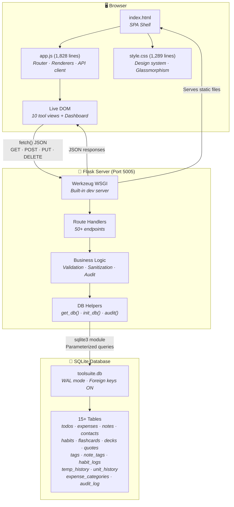
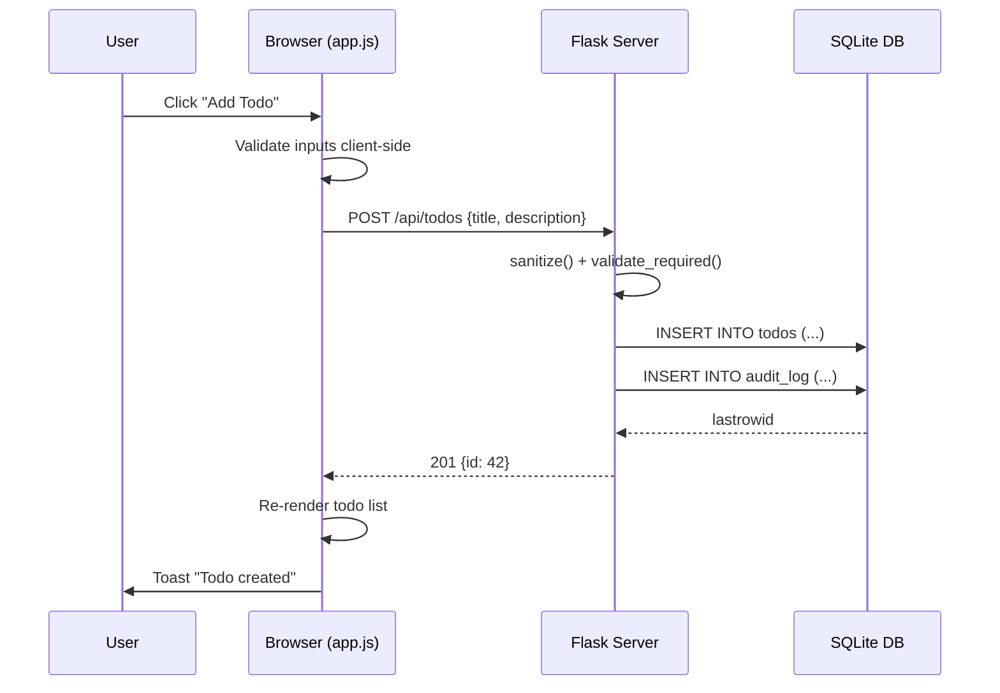
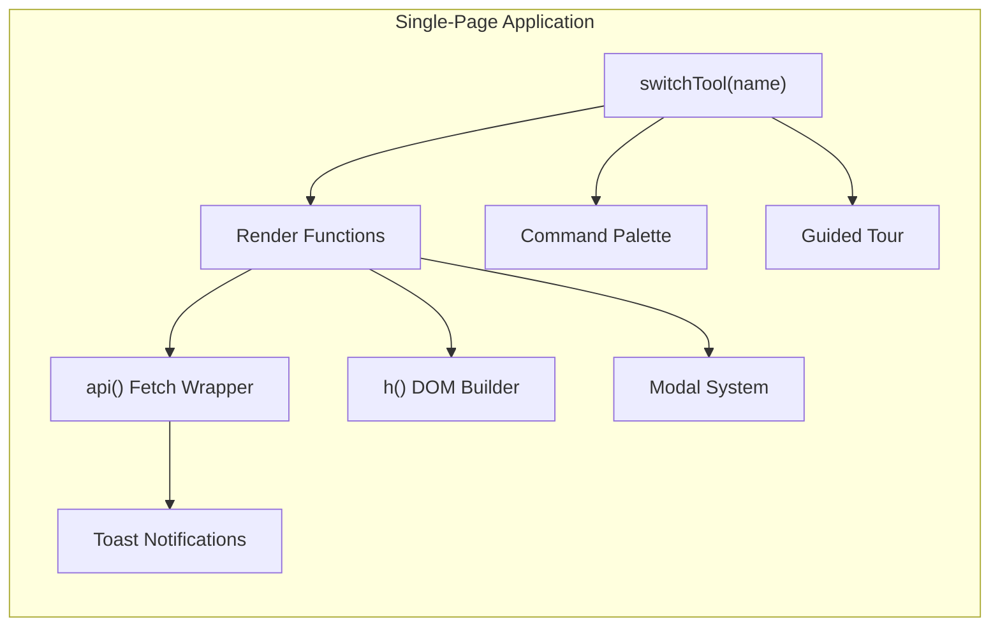
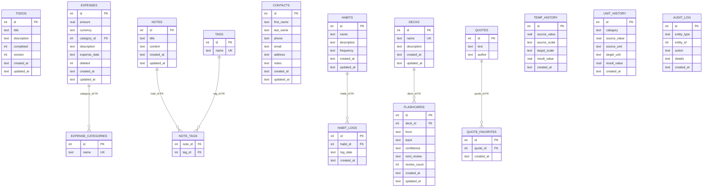
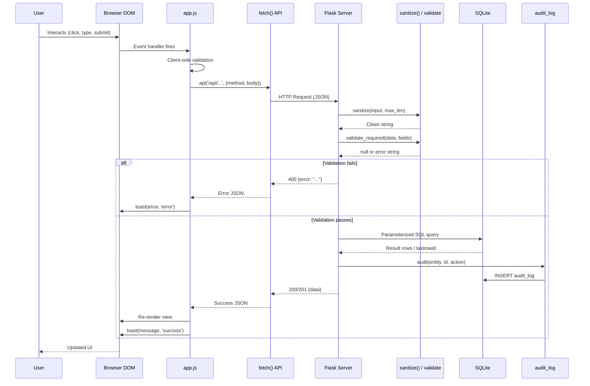
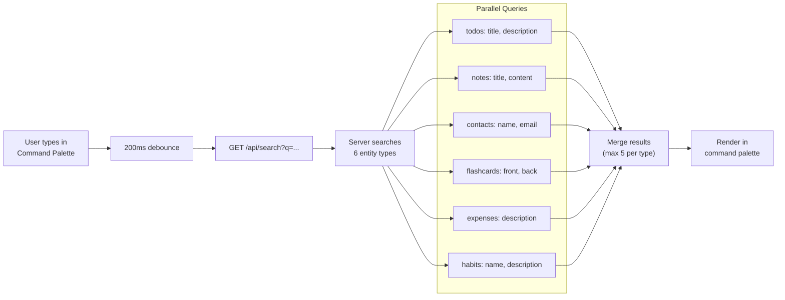
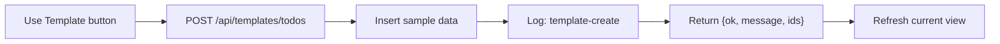
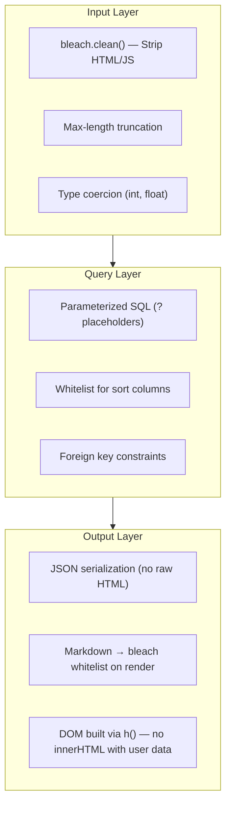
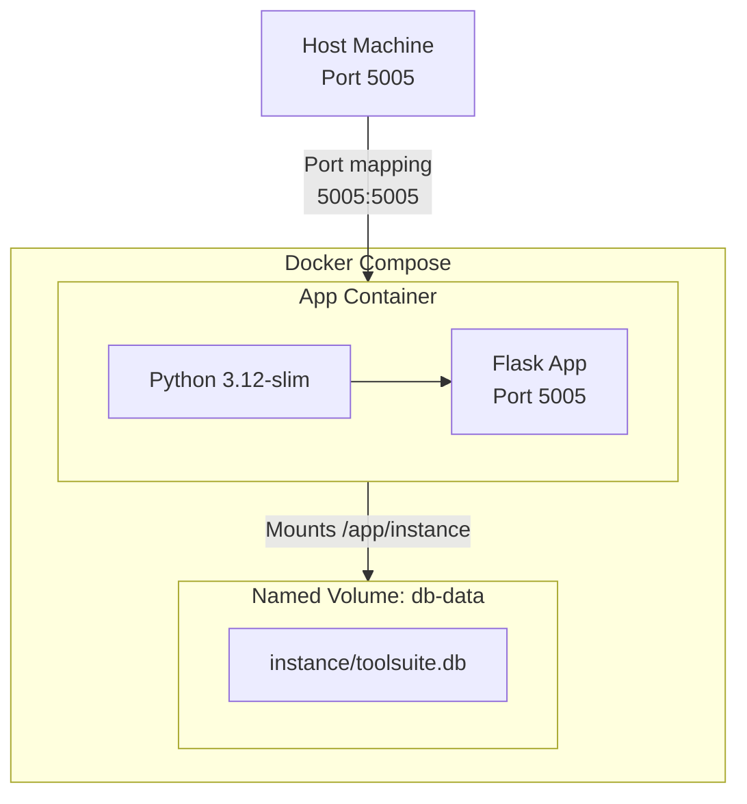

# Architecture — Easy Tools Suite

> A complete technical deep-dive into every layer of the **ToolSuite** 10-in-1 productivity platform: from the pixels in your browser down to the bytes on disk.

---

## Table of Contents

1. [High-Level Overview](#1-high-level-overview)
2. [System Architecture Diagram](#2-system-architecture-diagram)
3. [Frontend — Vanilla JS Single-Page Application](#3-frontend--vanilla-js-single-page-application)
4. [Backend — Flask REST API Server](#4-backend--flask-rest-api-server)
5. [Database — SQLite with WAL Mode](#5-database--sqlite-with-wal-mode)
6. [API Surface — Complete Endpoint Map](#6-api-surface--complete-endpoint-map)
7. [Data Flow — Request Lifecycle](#7-data-flow--request-lifecycle)
8. [Tool-by-Tool Architecture](#8-tool-by-tool-architecture)
9. [Cross-Cutting Features](#9-cross-cutting-features)
10. [Security Architecture](#10-security-architecture)
11. [Deployment Architecture](#11-deployment-architecture)
12. [File Structure](#12-file-structure)

---

## 1. High-Level Overview

ToolSuite is a **monolithic single-page application** that bundles 10 standalone productivity tools into one unified interface. The architecture follows a classic **3-tier pattern** — presentation, application logic, and data — collapsed into a single deployable unit for simplicity.

| Layer | Technology | Role |
|-------|-----------|------|
| **Presentation** | Vanilla JS + CSS | SPA shell, DOM rendering, client-side routing |
| **Application** | Flask 3.1 (Python) | REST API, business logic, input validation |
| **Data** | SQLite 3 (WAL mode) | Persistent storage, 15+ tables, relational integrity |

**Design principles:**
- Zero build step — no bundler, no transpiler, no framework. Ship raw JS + CSS.
- Single process — one Python process serves HTML, static files, and API.
- Embedded database — SQLite lives on the filesystem; no external DB server.
- Convention over configuration — sensible defaults, minimal config surface.

---

## 2. System Architecture Diagram

### Full Stack Overview



### Request Flow (Simplified)



---

## 3. Frontend — Vanilla JS Single-Page Application

### 3.1 Architecture Pattern

The frontend is a **manually-implemented SPA** with no framework. It uses a hash-free client-side router that maps tool names to render functions.



### 3.2 Core Utilities

| Function | Purpose | Lines |
|----------|---------|-------|
| `h(tag, attrs, ...children)` | Hyperscript-style DOM element builder. Creates elements declaratively without innerHTML. | ~15 |
| `api(url, opts)` | Thin fetch wrapper. Auto-sets JSON headers, serializes bodies, returns parsed JSON. | ~8 |
| `toast(msg, type)` | Appends a notification `<div>` that auto-removes after 3 seconds. | ~4 |
| `showModal(title, bodyEl, footerEl)` | Populates the global modal overlay with arbitrary DOM content. | ~6 |
| `confirmDialog(msg)` | Promise-based confirm using modal. Returns `true`/`false`. | ~8 |
| `debounce(fn, ms)` | Standard debounce (300ms default) for search inputs. | ~3 |
| `escapeHtml(s)` | XSS-safe text escaping via `textContent` → `innerHTML` trick. | ~4 |
| `createTemplate(tool, refreshFn)` | Calls `POST /api/templates/{tool}` then refreshes the view. | ~6 |

### 3.3 Client-Side Router

The router is driven by `data-tool` attributes on sidebar `<li>` elements. Clicking a nav item calls `switchTool(name)`, which:

1. Updates the `currentTool` state variable
2. Toggles the `.active` class on the sidebar
3. Updates the `#page-title` header text
4. Clears the `#app-container`
5. Calls the matching render function from a lookup map

```javascript
const renderers = {
    home: renderHome,         // Live dashboard
    todos: renderTodos,       // CRUD + search + pagination
    temperature: renderTemperature,  // Batch convert + history
    password: renderPassword,        // Real-time scoring
    expenses: renderExpenses,        // Tabs: list + summary + export
    quotes: renderQuotes,            // Daily + favorites + search
    contacts: renderContacts,        // CRUD + import/export CSV
    notes: renderNotes,              // Markdown editor + tags + preview
    habits: renderHabits,            // Streaks + calendar + stats
    units: renderUnits,              // 5 categories + history
    flashcards: renderFlashcards,    // Decks + study mode + SR rating
};
```

### 3.4 Rendering Strategy

Every tool view follows the same pattern:

```
async function renderToolName() {
    const c = container();          // Get #app-container
    c.innerHTML = '';                // Clear previous view
    // 1. Build toolbar (search bar, buttons, tabs)
    // 2. Fetch data: const data = await api('/api/...');
    // 3. Build DOM tree using h() calls
    // 4. Append to container
    // 5. Attach event listeners
}
```

All DOM is built programmatically with `h()` — **no `innerHTML` with user data**, preventing XSS by construction.

### 3.5 HTML Shell (`index.html`)

The entire HTML is 54 lines. It defines:

```
┌──────────────────────────────────────────────────┐
│  <nav id="sidebar">                              │
│    ├── .sidebar-header (logo + "ToolSuite")      │
│    └── <ul class="nav-list">                     │
│         ├── Home        (🏠)                     │
│         ├── Todo List   (☑️)                     │
│         ├── Temperature (🌡️)                    │
│         ├── Password    (🔒)                     │
│         ├── Expenses    (💰)                     │
│         ├── Quote       (💬)                     │
│         ├── Contacts    (👤)                     │
│         ├── Notes       (📝)                     │
│         ├── Habits      (🎯)                     │
│         ├── Units       (📏)                     │
│         └── Flashcards  (🃏)                     │
│                                                  │
│  <main id="main-content">                        │
│    ├── <header id="top-bar">                     │
│    │    ├── #menu-toggle (hamburger)             │
│    │    └── #page-title                          │
│    └── <div id="app-container"> ← JS renders    │
│                                                  │
│  <div id="modal-overlay">  ← Global modal       │
│  <div id="toast-container"> ← Notifications     │
│  <script src="app.js">                           │
└──────────────────────────────────────────────────┘
```

### 3.6 CSS Design System

The design system uses CSS custom properties for a **futuristic glassmorphism** aesthetic:

| Token | Value | Purpose |
|-------|-------|---------|
| Font: primary | Space Grotesk | All UI text |
| Font: mono | JetBrains Mono | Code blocks, badges |
| Color: primary | `#6366f1` (Indigo) | Buttons, accents, links |
| Color: background | `#0a0a0f` | Dark base |
| Color: surface | `rgba(255,255,255,0.04)` | Card backgrounds |
| Effect: glass | `backdrop-filter: blur(20px)` | Sidebar, modals |
| Effect: glow | `box-shadow: 0 0 30px rgba(99,102,241,0.15)` | Hover states |

Key CSS sections (~1,289 lines):
- **Reset & Variables** — Custom properties, base styles
- **Layout** — Sidebar (280px fixed) + main content (flex column)
- **Components** — Cards, buttons, forms, inputs, badges, tabs
- **Tool-Specific** — Password meter, habit calendar, note editor
- **Dashboard** — Stat cards grid, activity feed, progress bars
- **Command Palette** — Blur overlay, slide-in panel, result list
- **Guided Tour** — Overlay, highlight ring, step cards
- **Responsive** — Breakpoint at 860px collapses sidebar to overlay

---

## 4. Backend — Flask REST API Server

### 4.1 Server Structure

The entire backend is a single `app.py` file (1,852 lines) organized into clearly delimited sections:

```mermaid
graph TB
    subgraph app.py ["app.py — 1,852 lines"]
        direction TB
        A["Lines 1-16: Imports & App Init"]
        B["Lines 22-40: DB Helpers<br/><code>get_db() · close_db()</code>"]
        C["Lines 43-250: Schema + Seed Data<br/><code>init_db() — 15 tables + 50 quotes</code>"]
        D["Lines 252-275: Validation Helpers<br/><code>sanitize() · validate_required()</code>"]
        E["Lines 280-285: Page Route<br/><code>GET / → index.html</code>"]
        F["Lines 290-365: Todo API (6 endpoints)"]
        G["Lines 370-430: Temperature API (4 endpoints)"]
        H["Lines 435-560: Password API (1 endpoint)"]
        I["Lines 563-720: Expense API (7 endpoints)"]
        J["Lines 725-805: Quote API (5 endpoints)"]
        K["Lines 810-960: Contact API (6 endpoints)"]
        L["Lines 965-1100: Notes API (7 endpoints)"]
        M["Lines 1105-1280: Habit API (8 endpoints)"]
        N["Lines 1285-1400: Unit Converter API (3 endpoints)"]
        O["Lines 1405-1550: Flashcard API (8 endpoints)"]
        P["Lines 1555-1640: Dashboard API"]
        Q["Lines 1645-1700: Global Search API"]
        R["Lines 1705-1845: Template API"]
        S["Lines 1847-1852: Init + Main"]

        A --> B --> C --> D --> E --> F --> G --> H --> I --> J --> K --> L --> M --> N --> O --> P --> Q --> R --> S
    end
```



### 4.2 Application Configuration

```python
app = Flask(__name__)
app.config['DATABASE'] = os.path.join(app.instance_path, 'toolsuite.db')
os.makedirs(app.instance_path, exist_ok=True)
```

- Flask auto-detects `instance/` as the instance folder
- SQLite database stored at `instance/toolsuite.db`
- Directory is created on startup if missing
- No SECRET_KEY needed (no sessions/cookies/CSRF — pure API)

### 4.3 Database Connection Management

Flask's application context (`g`) is used for per-request connection pooling:

```python
def get_db():
    if 'db' not in g:
        g.db = sqlite3.connect(app.config['DATABASE'])
        g.db.row_factory = sqlite3.Row    # Dict-like access
        g.db.execute("PRAGMA journal_mode=WAL")   # Concurrent reads
        g.db.execute("PRAGMA foreign_keys=ON")     # Enforce FK constraints
    return g.db

@app.teardown_appcontext
def close_db(exc):
    db = g.pop('db', None)
    if db is not None:
        db.close()
```

**Key decisions:**
- `row_factory = sqlite3.Row` allows `dict(row)` conversion for JSON serialization
- WAL mode enables concurrent reads while one connection writes
- Foreign keys must be explicitly enabled per-connection in SQLite

### 4.4 Input Validation & Sanitization

Two layers of defense:

```python
def sanitize(text, max_len=500):
    """Strip, truncate, and HTML-sanitize input."""
    if text is None: return ""
    text = str(text).strip()
    return bleach.clean(text[:max_len])

def validate_required(data, fields):
    """Return error string if any required field is empty."""
    missing = [f for f in fields if not data.get(f, "").strip()]
    if missing: return f"Missing required fields: {', '.join(missing)}"
    return None
```

- **`bleach.clean()`** strips dangerous HTML tags/attributes (XSS prevention)
- **Max-length truncation** prevents oversized payloads
- **Parameterized queries** throughout (never string-concatenated SQL)

### 4.5 Audit Logging

Every create, update, and delete operation is recorded:

```python
def audit(entity_type, entity_id, action, details=""):
    db = get_db()
    db.execute(
        "INSERT INTO audit_log (entity_type, entity_id, action, details, created_at) VALUES (?,?,?,?,?)",
        (entity_type, entity_id, action, details, datetime.utcnow().isoformat())
    )
    db.commit()
```

The audit log powers the dashboard's "Recent Activity" feed and provides a complete change history.

---

## 5. Database — SQLite with WAL Mode

### 5.1 Entity-Relationship Diagram



### 5.2 Table Inventory

| # | Table | Purpose | Relationships |
|---|-------|---------|--------------|
| 1 | `todos` | Task items with completion + versioning | — |
| 2 | `temp_history` | Temperature conversion log | — |
| 3 | `expense_categories` | Expense categories (seeded: 8 defaults) | → expenses |
| 4 | `expenses` | Expense records with soft delete | → expense_categories |
| 5 | `quotes` | 50 seeded motivational quotes | → quote_favorites |
| 6 | `quote_favorites` | User-favorited quotes | → quotes |
| 7 | `contacts` | Contact book entries | — |
| 8 | `notes` | Markdown notes | → note_tags |
| 9 | `tags` | Tag names (unique) | → note_tags |
| 10 | `note_tags` | Many-to-many: notes ↔ tags | → notes, tags |
| 11 | `habits` | Habit definitions | → habit_logs |
| 12 | `habit_logs` | Daily completion logs (unique per habit+date) | → habits |
| 13 | `unit_history` | Unit conversion log | — |
| 14 | `decks` | Flashcard deck containers | → flashcards |
| 15 | `flashcards` | Individual cards with spaced repetition metadata | → decks |
| 16 | `audit_log` | Cross-tool audit trail | — |

### 5.3 SQLite Configuration

| PRAGMA | Value | Purpose |
|--------|-------|---------|
| `journal_mode` | WAL | Write-Ahead Logging — allows concurrent readers during writes |
| `foreign_keys` | ON | Enforces referential integrity (SQLite default is OFF) |

### 5.4 Data Seeding

On first run, `init_db()`:
1. Creates all 16 tables using `CREATE TABLE IF NOT EXISTS`
2. Seeds 8 default expense categories (`INSERT OR IGNORE`)
3. Seeds 50 quotes if the quotes table is empty

---

## 6. API Surface — Complete Endpoint Map

### Overview: 55+ REST Endpoints


### Detailed Endpoint Table

| Tool | Method | Endpoint | Description |
|------|--------|----------|-------------|
| **Todo** | GET | `/api/todos?page=&q=` | List todos with pagination + search |
| | POST | `/api/todos` | Create todo |
| | PUT | `/api/todos/:id` | Update todo (optimistic locking via `version`) |
| | DELETE | `/api/todos/:id` | Delete todo |
| **Temperature** | POST | `/api/temperature/convert` | Batch convert between C/F/K |
| | GET | `/api/temperature/history` | Recent conversions |
| | DELETE | `/api/temperature/history` | Clear history |
| **Password** | POST | `/api/password/check` | Score a password (never logged) |
| **Expenses** | GET | `/api/expenses?start=&end=&category=&page=` | List with date/category filters |
| | POST | `/api/expenses` | Create expense |
| | PUT | `/api/expenses/:id` | Update expense |
| | DELETE | `/api/expenses/:id` | Soft delete (`deleted=1`) |
| | GET | `/api/expenses/categories` | List categories |
| | POST | `/api/expenses/categories` | Create category |
| | GET | `/api/expenses/summary?month=` | Monthly breakdown by category |
| | GET | `/api/expenses/export` | Download CSV |
| **Quotes** | GET | `/api/quotes/today` | Deterministic daily quote |
| | GET | `/api/quotes/date/:dt` | Quote for specific date |
| | POST | `/api/quotes/favorite` | Toggle favorite |
| | GET | `/api/quotes/favorites?sort=` | List favorites (sort by date/author/text) |
| | GET | `/api/quotes/search?q=` | Search quotes |
| **Contacts** | GET | `/api/contacts?q=&sort=&page=` | List with search, sort, pagination |
| | POST | `/api/contacts` | Create (with duplicate phone detection) |
| | PUT | `/api/contacts/:id` | Update contact |
| | DELETE | `/api/contacts/:id` | Delete contact |
| | GET | `/api/contacts/export` | Download CSV |
| | POST | `/api/contacts/import` | Upload CSV |
| **Notes** | GET | `/api/notes?q=&tag=&page=` | List with search, tag filter, pagination |
| | POST | `/api/notes` | Create note with tags |
| | GET | `/api/notes/:id` | Get note with rendered Markdown |
| | PUT | `/api/notes/:id` | Update note + tags |
| | DELETE | `/api/notes/:id` | Delete note |
| | GET | `/api/notes/tags` | List all tags with counts |
| | POST | `/api/notes/render` | Render Markdown to safe HTML |
| **Habits** | GET | `/api/habits` | List with streaks + today status |
| | POST | `/api/habits` | Create habit |
| | PUT | `/api/habits/:id` | Update habit |
| | DELETE | `/api/habits/:id` | Delete habit |
| | POST | `/api/habits/:id/toggle` | Toggle today's completion |
| | GET | `/api/habits/:id/calendar?month=` | Monthly calendar data |
| | GET | `/api/habits/stats` | Completion rates + streaks |
| **Units** | GET | `/api/units/categories` | Available categories + units |
| | POST | `/api/units/convert` | Convert values |
| | GET | `/api/units/history` | Recent conversions |
| | DELETE | `/api/units/history` | Clear history |
| **Flashcards** | GET | `/api/decks` | List decks with card stats |
| | POST | `/api/decks` | Create deck |
| | PUT | `/api/decks/:id` | Update deck |
| | DELETE | `/api/decks/:id` | Delete deck (cascades cards) |
| | GET | `/api/decks/:id/cards?q=` | List cards in deck |
| | POST | `/api/decks/:id/cards` | Add card to deck |
| | GET | `/api/decks/:id/study` | Get cards in study order |
| | PUT | `/api/cards/:id` | Edit card |
| | DELETE | `/api/cards/:id` | Delete card |
| | POST | `/api/cards/:id/rate` | Rate card (easy/medium/hard → spaced repetition) |
| **Dashboard** | GET | `/api/dashboard` | Aggregated stats from all tools |
| **Search** | GET | `/api/search?q=` | Cross-tool full-text search |
| **Templates** | POST | `/api/templates/:tool` | Generate sample data for any tool |

---

## 7. Data Flow — Request Lifecycle

### 7.1 Complete Request Journey



### 7.2 Dashboard Data Aggregation

The `/api/dashboard` endpoint performs 12 separate queries in a single request:

```
GET /api/dashboard

→ COUNT(*) FROM todos
→ COUNT(*) FROM todos WHERE completed=0
→ SUM(amount) FROM expenses WHERE date >= month_start
→ COUNT(*) FROM expenses WHERE deleted=0
→ COUNT(*) FROM notes
→ COUNT(*) FROM contacts
→ COUNT(*) FROM habits
→ COUNT(DISTINCT habit_id) FROM habit_logs WHERE today
→ COUNT(*) FROM decks + flashcards + mastered + due
→ COUNT(*) FROM unit_history WHERE today
→ COUNT(*) FROM temp_history WHERE today
→ SELECT * FROM audit_log ORDER BY created_at DESC LIMIT 8
→ SELECT text, author FROM quotes (daily rotation)

← JSON: {todos, expenses, notes, contacts, habits, flashcards, conversions, quote, recent_activity}
```

### 7.3 Global Search Flow



---

## 8. Tool-by-Tool Architecture

### Tool 1: Todo List

| Feature | Implementation |
|---------|---------------|
| CRUD | Standard REST endpoints |
| Pagination | Server-side, 50 per page |
| Search | Case-insensitive LIKE on title + description |
| Optimistic locking | `version` column — PUT checks version match, returns 409 on conflict |
| Completion toggle | PUT with `completed` boolean flip |
| Delete | Hard delete with audit log |

### Tool 2: Temperature Converter

| Feature | Implementation |
|---------|---------------|
| Scales | Celsius, Fahrenheit, Kelvin |
| Batch conversion | POST accepts `values[]` array |
| Absolute zero validation | Per-scale minimum checks |
| Conversion history | `temp_history` table, last 100 entries |
| Algorithm | Source → Celsius → Target (two-step) |

### Tool 3: Password Strength Checker

| Feature | Implementation |
|---------|---------------|
| Scoring | 0–100 scale with weighted criteria |
| Character classes | +15 uppercase, +10 lowercase, +15 digit, +15 special |
| Length bonus | +20 (≥8), +10 (≥12), +5 (≥16) |
| Pattern detection | Sequential chars, repeated chars (`(.)\1{2,}`), keyboard patterns |
| Dictionary check | 25 common passwords + leetspeak substitution detection |
| Security | Password is **never logged** or stored |

### Tool 4: Expense Tracker

| Feature | Implementation |
|---------|---------------|
| Categories | Seeded defaults (8) + user-created |
| Soft delete | `deleted` flag instead of hard delete |
| Date filtering | `start` and `end` query params |
| Monthly summary | GROUP BY category with percentage calculation |
| CSV export | In-memory CSV generation via `StringIO` |
| Currency | Stored per-expense (default USD) |

### Tool 5: Quote of the Day

| Feature | Implementation |
|---------|---------------|
| Daily rotation | `date.today().toordinal() % total_quotes` — deterministic, no randomness |
| Historical lookup | `/api/quotes/date/:dt` for any past/future date |
| Favorites | Toggle via junction table `quote_favorites` |
| Favorite sorting | By date, author, or text |
| Search | LIKE on text + author fields |
| Seed data | 50 curated quotes loaded on first init |

### Tool 6: Contact Book

| Feature | Implementation |
|---------|---------------|
| Sorting | Allowed: last_name, first_name, created_at (whitelist) |
| Duplicate detection | Phone number uniqueness check on create |
| Email validation | Regex: `^[^@\s]+@[^@\s]+\.[^@\s]+$` |
| CSV import | DictReader with flexible column name mapping |
| CSV export | Full contact list ordered by last name |
| Search | Across first_name, last_name, phone, email |

### Tool 7: Markdown Notes

| Feature | Implementation |
|---------|---------------|
| Markdown rendering | `markdown` library with fenced_code, tables, codehilite extensions |
| XSS prevention | `bleach.clean()` with whitelisted tags/attributes on render |
| Tagging | Many-to-many via `note_tags` junction table |
| Tag filtering | JOIN-based query with tag name match |
| Live preview | Client calls `POST /api/notes/render` while typing |
| Storage | Raw Markdown stored; rendered on read |

### Tool 8: Habit Tracker

| Feature | Implementation |
|---------|---------------|
| Frequencies | `daily` or `weekdays` (skip Sat/Sun) |
| Daily toggle | Insert/delete in `habit_logs` (UNIQUE on habit_id + log_date) |
| Current streak | Iterates backward from today counting consecutive completions |
| Longest streak | Scans all logs, tracks max consecutive run |
| Calendar view | Returns logged dates for a given month + completion percentage |
| Statistics | Completion rate = total_logs / days_since_creation |

### Tool 9: Unit Converter

| Feature | Implementation |
|---------|---------------|
| Categories | Length, Weight, Volume, Area, Speed |
| Units per category | 5–9 units each |
| Algorithm | Source → Base Unit (multiply) → Target (divide) |
| Batch conversion | POST accepts `values[]` array |
| Negative validation | Rejected for weight, volume, area |
| History | `unit_history` table, last 100 entries |

### Tool 10: Flashcard Study

| Feature | Implementation |
|---------|---------------|
| Deck management | CRUD with unique name constraint |
| Card management | CRUD within deck scope |
| Study order | Priority: new → learning → mastered, then by next_review ASC |
| Spaced repetition | Rating modifies `confidence` + `next_review`: easy=7d, medium=3d, hard=8h |
| Confidence levels | `new`, `learning`, `mastered` |
| Deck stats | Aggregate counts per confidence level |

---

## 9. Cross-Cutting Features

### 9.1 Live Dashboard

The Home page is a real-time dashboard that aggregates data from all 10 tools:

```
┌──────────────────────────────────────────────────────────┐
│  🏠 AI Workshop — Live Dashboard                         │
│  "Your unified productivity dashboard"                   │
│  [⌘K Search Everything]  [▶ Guided Tour]                │
├──────────────────────────────────────────────────────────┤
│  ┌──────┐ ┌──────┐ ┌──────┐ ┌──────┐ ┌──────┐ ┌──────┐│
│  │ Todos│ │Expens│ │Notes │ │Contac│ │Habits│ │Flash │ │
│  │ 3/5  │ │$24.50│ │  2   │ │  1   │ │ 1/1  │ │3 due │ │
│  └──────┘ └──────┘ └──────┘ └──────┘ └──────┘ └──────┘│
│                                                          │
│  💡 Quote of the Day                                     │
│  "The way to get started is to quit talking..."          │
│                                                          │
│  ⚡ Quick Actions      📊 Flashcard Mastery Progress    │
│  [+Todo] [+Expense]    ████████░░░░ 67%                 │
│  [+Note] [+Contact]                                      │
│  [+Habit]                                                │
│                                                          │
│  📋 Recent Activity                                      │
│  • todo created — "Launch MVP"      2 min ago            │
│  • expense created — "$24.50"       5 min ago            │
│  • contact created — "Ava Patel"    8 min ago            │
└──────────────────────────────────────────────────────────┘
```

Each stat card is clickable and navigates to the corresponding tool.

### 9.2 Command Palette (Ctrl+K)

```
┌─────────────────────────────────────────────┐
│ ⌘  Search across all tools…          [ESC]  │
├─────────────────────────────────────────────┤
│ Quick Navigation                             │
│  ☑ Todo List                    [Navigate]  │
│  📝 Markdown Notes              [Navigate]  │
│  💰 Expense Tracker             [Navigate]  │
│  👤 Contact Book                [Navigate]  │
│  🎯 Habit Tracker               [Navigate]  │
│  🃏 Flashcards                  [Navigate]  │
│  ...                                         │
├─────────────────────────────────────────────┤
│ (Type to search across all data)             │
│ Results update live with 200ms debounce      │
│ Enter selects first result                   │
│ Searches: todos, notes, contacts,            │
│   flashcards, expenses, habits               │
└─────────────────────────────────────────────┘
```

### 9.3 Guided Tour

8-step interactive walkthrough:

| Step | Tool | Focus |
|------|------|-------|
| 1 | Home | Welcome — explains the dashboard |
| 2 | Todos | Task management + templates |
| 3 | Expenses | Categories, summaries, CSV export |
| 4 | Notes | Markdown, tags, search |
| 5 | Habits | Streaks, calendar, statistics |
| 6 | Flashcards | Decks, study mode, spaced repetition |
| 7 | Home | Command palette introduction |
| 8 | Home | Tour complete — summary |

Each step highlights a DOM element with a glowing ring and displays a floating card with navigation controls.

### 9.4 Template System

Every tool supports one-click demo data generation via `POST /api/templates/:tool`:



---

## 10. Security Architecture

### 10.1 Defense Layers



### 10.2 Threat Mitigation

| Threat | Mitigation |
|--------|-----------|
| **SQL Injection** | All queries use parameterized placeholders (`?`). Zero string concatenation with user input. |
| **XSS (Stored)** | `bleach.clean()` on all inputs. Markdown rendered through whitelist sanitizer. |
| **XSS (DOM)** | Frontend uses `h()` builder with `textContent` — never `innerHTML` with user data. `escapeHtml()` helper available. |
| **Code Injection** | No `eval()`, no server-side template injection, no dynamic imports. |
| **Mass Assignment** | Each field explicitly extracted and validated — no bulk `**kwargs` binding. |
| **Enumeration** | Generic "Not found" errors (no information about other IDs). |
| **Denial of Service** | Pagination (50/page), result limits (LIMIT 5/50/100), input truncation. |
| **Password Exposure** | Password checker never logs or stores the password. |
| **Soft Delete Safety** | Expenses use soft delete (`deleted=1`), preventing accidental data loss. |
| **Optimistic Locking** | Todo updates check `version` before modifying — prevents lost updates. |

---

## 11. Deployment Architecture

### 11.1 Local Development

```bash
# Option 1: Direct Python
make install    # pip install -r requirements.txt
make run        # python app.py → http://localhost:5005

# Option 2: Docker
make docker-up  # docker compose up --build -d
```

### 11.2 Docker Architecture



### 11.3 Container Details

| Property | Value |
|----------|-------|
| Base image | `python:3.12-slim` |
| Working directory | `/app` |
| Exposed port | `5005` |
| Data volume | `db-data` → `/app/instance` |
| Restart policy | `unless-stopped` |
| Dependencies | flask==3.1.0, markdown==3.7, bleach==6.2.0 |

---

## 12. File Structure

```
examples/easy-tools-suite/
├── app.py                    # 1,852 lines — Flask backend (all routes + logic)
├── requirements.txt          # 3 dependencies: flask, markdown, bleach
├── Dockerfile                # Python 3.12-slim container
├── docker-compose.yml        # Single service + named volume
├── Makefile                  # install, run, docker-up, docker-down, clean
├── .gitignore                # Excludes .venv/, __pycache__/, instance/, *.db
├── USER_STORY_COVERAGE.md    # Maps user stories → implementation status
│
├── templates/
│   └── index.html            # 54 lines — SPA shell (sidebar + main + modal)
│
├── static/
│   ├── css/
│   │   └── style.css         # 1,289 lines — Full design system
│   └── js/
│       └── app.js            # 1,828 lines — Complete SPA frontend
│
└── instance/                 # (gitignored) Runtime directory
    └── toolsuite.db          # SQLite database (created on first run)
```

**Total codebase: ~5,023 lines of hand-written code across 3 source files + 54-line HTML shell.**

---

> *This architecture document was generated from a live analysis of the running codebase. All line counts, endpoint counts, and table schemas are verified against the actual source.*
